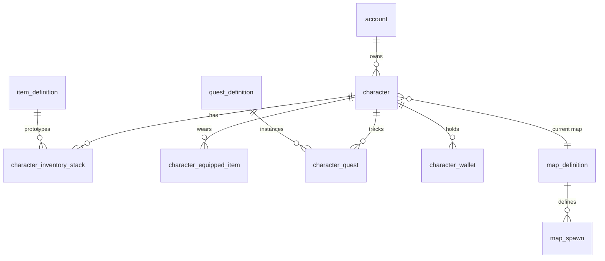

# Plan de base de données MariaDB — schéma cible complet

Document de **cible long terme** pour limiter les refontes : il décrit tout ce qui est raisonnable d’imaginer pour un petit **MMO type Zelda / RPG** (dont FRoG), même si certaines fonctionnalités ne sont pas encore dans le produit.

**Réalité projet :** aujourd’hui le fichier `schema_frog_mariadb_v1.sql` pose les premières briques (`accounts`, `player_world_state`, `frog_map`, `frog_character`, etc.). Ce plan indique **où étendre** sans casser tout à chaque feature.

Une **traduction courte** :

- **`account_*`** → identité joueur hors jeu.
- **`character_*`** → tout ce qui est **persisté par perso** (inventaire, quêtes, position).
- **`game_*` / définitions** → données **auteur** (objets modèles, scripts, définitions NPC) réutilisables par tous les serveurs.
- Réserver les préfixes évite les collisions avec des noms génériques (`items` tout seul = ambigu entre définition et instance).

Tu peux migrer progressivement depuis `frog_*` vers ces noms dans des scripts versionnés (Flyway, scripts SQL numérotés, etc.). Le plan est **conceptuel** : les DDL exacts viendront migrés phase par phase.

---

## 1. Principes pour éviter trop de churn

| Principe | Pourquoi |
|----------|----------|
| **PK techniques** (`BIGINT` auto-incrément ou `BINARY(16)` UUID) pour entités volumineuses et jointures | Stable, performances index, pas de refactor quand `display_name` change. |
| **`account_id` numérique** en remplacement lent de `accounts.username` comme FK principale | Moins fragile que le login texte pour les FK et les renommages futurs. Garder `username` unique. |
| **`character_id` unique** déjà prévu UUID ; évolution possible `BINARY(16)` pour gain place | Compatible clients / merge de shards plus tard si besoin. |
| **`JSON`/`JSONB` MariaDB pour « extension »**, colonnes typed pour données **filtriées/triées** ou **economie** critique | Stats / flags monde **déjà** sortis du JSON perso côté MariaDB (**`character_stat`**, **`character_world_flag`**). Réserver `JSON` aux extras non structurés (quêtes légères, prefs) jusqu’à stabilisation puis tables dédiées. |
| **`revision` / `content_sha256` sur blobs** (cartes, manifests) comme aujourd’hui | Synchro client et éditeur sans télécharger tout. |
| **`created_at`, `updated_at`, `deleted_at` (soft delete) sur entités authoring** | Récupération, audit RGPD, désactivation sans perte brutale. |
| **Tables de liaison avec PK composite** où le couple (A,B) est unique (`character_quest`, équipements) | Modèle ER clair, pas de lignes zombies. |
| **Séparation définition ↔ instance** | Un **item prototype** ≠ une **pile d’objets inventaire** avec stats roulées. |
| **`schema_version` ou table `migration_history`** hors ORM Bootstrap | Produire des migrations lisibles au lieu seulement `IF NOT EXISTS` infini. |

---

## 2. Cartographie v1 → cible

| Actuel (v1 / v2 en cours) | Évolution prévue |
|-------------|------------------|
| `accounts` (**PK username** ; **v2 :** colonne **`id` BIGINT UNSIGNED** AUTO_INCREMENT UNIQUE) | À terme : PK = `id`, `username` unique ; migrer FK (`player_world_state`, etc.). **v2 appliquée en runtime** (`MariaDbMigrationV2`). |
| `player_world_state` (PK username) | Migrer PK vers **`character_id`** (perso comme unité monde) ou doublon `accountusername` résiduel jusqu’à fin de mig ; position = **par perso**. |
| `frog_character` | Renomme conceptuel **`character`** : stats / drapeaux / extras **relationnels + LONGTEXT** (`character_stat`, `character_world_flag`, `character_payload_kv`, **v8–v10**) ; plus de colonne `payload` JSON côté MariaDB. |
| `frog_map` | Reste carte **révisionnée blob** ; liens vers **spawn**, **warp** en données tabulaires ou dans blob selon stratégie. |
| `frog_asset_blob`, `frog_map_editor_save` | Consolider sous famille **`game_asset`** / **`editor_audit`**. |

---

## 3. Domaines et tables envisagées (inventaire complet)

Ci-dessous : **liste cible**. Toutes les tables ne sont pas à créer demain ; c’est une **boussole**.

### 3.1 Compte & sécurité

- **`account`** — id, username unique, hash/sel ou liaisons auth OAuth, créé/le, dernier_login, préférences léger JSON, timezone, langue.
- **`account_credential`** (optionnel si multi-login) — type (password/oauth), identifiant externe, lien `account_id`.
- **`session_token` / `refresh_token`** — si jeu web ou launcher ; TTL, revocation, device id.
- **`account_penalty`** — ban / mute / motif / expiration (modération).

### 3.2 Personnage

Sous MariaDB dans ce dépôt : les **stats** (STR…LUCK), les **`worldFlags`** et les **autres clés racine** du JSON perso (sous plafonds) sont dans **`character_stat`**, **`character_world_flag`**, **`character_payload_kv`** (**`MariaDbMigrationV8`** / **`MariaDbMigrationV9`**, assemblage dans **`MariaDbCharacterPayloadReader`**) ; le client reçoit toujours un JSON **`CharacterPayload`** agrégé.

- **`character`** — `id`, `account_id`, nom affiché, slot, niveau XP, carte courante id, coords (tuile ou pixel selon jeu), état santé/resource, **equipment_snapshot** léger ou join tables, **`stats_json`** / **`appearance_json`** en phase exploratory (cible long terme ; les stats « fixes » six attributs sont déjà relationnelles côté serveur).
- **`character_slot`** — nombre de persos max, déblocage boutique (optionnel).
- **`character_progression`** — arbre de talents, points non dépensés (ou fusion dans JSON si simple).

### 3.3 Monde & cartes

- **`map_definition`** — id jeu, clé stable, nom, révision, hash, blob fmap (ou référence fichier), mode (overworld, donjon, instance).
- **`map_instance`** (phase instances) — id instance, `map_definition_id`, seed, durée de vie, owner_guild_id optionnel.
- **`map_spawn_point`** — map_id, type (player/npc), x, y, tag script.
- **`world_region`** — regroupement de maps pour chat / téléport / quêtes (optionnel).

### 3.4 Objets (définitions auteur — « données jeu »)

- **`item_definition`** — id jeu, nom, icône asset ref, pile max, prix base, tags (arme/consommable/quest), **effets_json** ou tables **effets** si besoin de requêtes fines.
- **`item_recipe`** (craft) — résultat `item_definition_id`, station, niveau craft.
- **`item_recipe_ingredient`** — recipe_id, item_id, quantité.

### 3.5 Inventaire & équipement (instances joueur)

**Implémentation v1 (dépôt actuel)** — inventaire **relationnel** dans MariaDB : **`frog_item_definition`**, **`character_inventory_slot`**. Données perso hors inventaire : **`character_stat`**, **`character_world_flag`**, **`character_payload_kv`** (LONGTEXT) — pas de type JSON SQL sur **`frog_character`**. Voir `schema_frog_mariadb_v1.sql` et migrations **V7–V10**.

**Cible étendue** (évolution sans renommer le cœur v1 si possible) :

- **`character_inventory_stack`** — `character_id`, `stack_id`, `item_definition_id`, quantité, **durabilité**, **bonus_reroll_json**, slot banque/inventaire, position UI (ordonner).
- **`character_equipped_item`** — `character_id`, slot (épée, bouclier, …), lien `stack_id` ou duplication si design « copie équipée ».

### 3.6 Combat & stats runtime (persistance)

Ce qui doit survivre après déco : vie/mana/resource, cooldowns longs, effets prolongés si design le demande.

- **`character_buff_active`** — caractère id, buff type id, fin timestamp, piles.
- **`character_cooldown`** — cooldown id jeu, jusqu’à quand.

(Beaucoup peuvent vivre uniquement RAM ; ne persiste que si le design jeu l’impose.)

### 3.7 Quêtes

- **`quest_definition`** — id, titre, flags, prerequisites JSON/texte script id.
- **`character_quest`** — `character_id`, `quest_definition_id`, statut (inactive/active/complete/reward_claimed), objectifs progression JSON ou colonnes typed par type de quest primitif.

### 3.8 NPC & dialoque (si hors script pur dans map)

- **`npc_spawn`** — carte, position, définition_npc_id, respawn timing.
- **`npc_definition`** — nom, comportement résume, loot table ref, dialogue ref.
- **`dialogue_*`** — arbres/dialogue lignes ou réf vers assets JSON externes.

### 3.9 Économie

- **`currency_type`** — or, gems, faction tokens…
- **`character_wallet`** — `character_id`, `currency_type_id`, quantité BIGINT (avec contrainte unique couple).
- **`trade_log`** / **`auction`** (très tard) — acheteur, vendeur, item_stack, prix.

### 3.10 Social & guilde

- **`guild`** — nom, tag, niveau.
- **`guild_member`** — guild_id, character_id, rang.
- **`friendship`** ou **`social_edge`** — statut invitation/bloqué/deux sens.
- **`mail_message`** — expéditeur, destinataire character_id ou account, pj, annexes pièces jointes références item_stack.

### 3.11 Chat & audit (facultatif / conformité)

- **`chat_archive`** — retention courte, RGPD configurable.
- **`moderation_ticket`** — liens snapshots.

### 3.12 Éditeur & assets pipelines

- **`asset_blob`** (déjà proche `frog_asset_blob`) — hash, mime, bytes ou URL S3 futur.
- **`map_publish_event`** — historique comme `frog_map_editor_save`, enrichi reviewer, rollout id.

### 3.13 Localisation / contenu dynamique

- **`localized_string`** — clé, langue, texte pour items/quêtes UI sans redesployer tout le client.

---

## 4. Diagramme ER haut niveau (Mermaid)

---

## 5. Stratégie de rollout (pour limiter les gros mouvements)

1. **v1 actuel** — compte, monde perso, carte blob, Hero + character_uuid où c’est fait.
2. **v2** — introduire **`account_id` BIGINT**, migrer `accounts` puis progressivement FK (feature flags).
3. **v3** — **`player_world_state` par character_id** (PK `character_id`) ; username devient agrégat via JOIN.
4. **v4 data jeu** — `item_definition`, `character_inventory_stack` minimal (stack + qty + ref définition).
5. **v5+** — quêtes, wallet, équipement détaillé, crafting, social selon roadmap produit.

Chaque étape doit être une **migration nommée** + tests de rollback ou backup documenté.

---

## 6. Décisions volontaires (à fixer équipe avant de coder DDL)

| Sujet | Option A | Option B |
|-------|-----------|-----------|
| Unité monde perso | Compte (= un seul perso jouable) comme aujourd’hui | Toujours **character_id** comme source vérité position |
| Objet équipé | Réfère à `inventory_stack_id` | Copie définition dans ligne équipment (duplicate) |
| Quêtes | JSON simple par perso | Table objectifs relational (plus cher à maintenir) |
| Scripts NPC | 100 % dans format carte / fichier | Partiel DB pour quêtes liées PNJ |

Documenter ces choix dans `README` équipe évite trois refactors Inventaire.

---

## 7. Liens avec le dépôt

- Implémentation actuelle : **`Frog.Server/Docs/mariadb-persistence-plan.md`**, DDL **`Database/schema_frog_mariadb_v1.sql`**.
- Modèles binaires / protocole : **`Frog.Core`**, **`Frog.Client/Docs/protocol_login_map.md`**.

---

## 8. Synthèse

La base finale ressemble à un **jeu données relationnel standard** :

- couches **identity** (`account*`),
- **runtime perso** (`character*`),
- **définitions auteur réutilisables** (`*_definition`),
- **économie & social** en modules qui s’accrochent avec des FK strictes là où la cohérence compte,

et **`JSON`** là où tu itères encore vite sur les features.

Ce plan ne remplace pas des migrations précises mais donne une **empreinte ER stable** avant d’investir trois mois d’OBJ dans un format qui doit être refactoré après.
