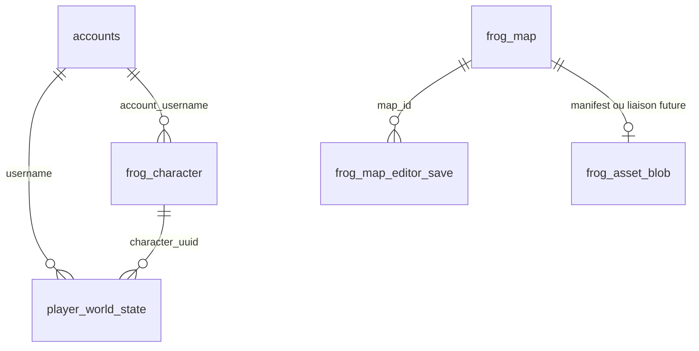

# PostgreSQL — persistance complète (plan et schéma)

Ce document décrit le **modèle relationnel cible**, ce qui est **déjà câblé** dans le code, et la **feuille de route** pour comptes, personnages, cartes, éditeur et synchro client (y compris ce que tu n’as pas encore nommé explicitement).

**Secrets :** ne jamais committer mots de passe ou chaînes de connexion réelles. Utiliser `Frog.Server/appsettings.Local.json` (ignoré par Git) en copiant `appsettings.Local.json.example`, ou des **variables d’environnement** (`Postgres__ConnectionString`, etc.).

---

## 1. Configuration locale (sans secrets dans Git)

1. Copier `appsettings.Local.json.example` → `appsettings.Local.json` dans le dossier **`Frog.Server/`** du dépôt. S’il est présent à la build, il est copié vers `bin/.../net8.0/` comme `appsettings.json`. Sinon, place aussi une copie à côté de `Frog.Server.dll` si tu lances l’EXE sans passer par le projet.
2. Renseigner `Postgres:enabled`, `Postgres:connectionString`, et éventuellement `Maps:databaseFallbackMapId` (voir §4).
3. Le serveur charge `appsettings.json` puis **`appsettings.Local.json`** (optionnel, rechargement possible).

### 1.1 Tests avec une vraie base

```powershell
$env:POSTGRES_TEST_CONNECTION_STRING = "Host=...;Port=...;Database=...;Username=...;Password=...;SSL Mode=Disable"
dotnet test --filter "FullyQualifiedName~PostgresSchemaIntegration"
```

Si Npgsql échoue avec une erreur SSL, **`SSL Mode=Disable`** peut suffire.  
Si vous voyez **`Internal Npgsql bug`** / **`FunctionCallResponse`** pendant l’authentification, le port n’est probablement **pas** le protocole PostgreSQL natif (autre service, proxy, ou PgBouncer en mode incompatible) : vérifiez l’hôte/port côté infra.

---

## 2. Schéma relationnel (v1 — fichier SQL)

Le fichier `Database/schema_frog_persistence_v1.sql` est appliqué au démarrage si `Postgres.enabled` est `true` (`PostgresSchemaBootstrap.Apply`).

### 2.1 Entités principales

| Table | Rôle |
|--------|------|
| **accounts** | Compte joueur (login, hash, sel, date création). |
| **player_world_state** | Dernière position / carte pour un compte (`username` → FK `accounts`). Colonne optionnelle **character_uuid** pour rattacher l’état à un perso (v1 préparatoire). |
| **frog_map** | Carte auteur : `id` (identifiant jeu, ex. 1 = monde), `map_key` (slug stable), `display_name`, **revision** (entier monotone par carte), **content_sha256** (empreinte du `.fmap` sérialisé), **fmap_blob** (BYTEA). |
| **frog_character** | Personnage : `id` UUID, `account_username`, `display_name`, **payload** JSONB (stats, classe, inventaire léger… extensible sans migration à chaque champ). |
| **frog_asset_blob** | Fichiers binaires dédupliqués (PNG tileset, etc.) indexés par SHA-256 ; à relier aux cartes via manifest JSON ou table de liaison (phase suivante). |
| **frog_map_editor_save** | Historique des sauvegardes éditeur (qui, quelle révision, quand) — audit et rollback futurs. |

### 2.2 Diagramme ER (simplifié)



### 2.3 Bonnes pratiques PostgreSQL (évolution)

- **Clés de substitution** : `frog_character.id` en UUID évite les collisions inter-serveurs ; `frog_map.id` INT reste aligné avec les IDs de carte côté jeu (warps, `map_id` dans le protocole).
- **Révision + hash** : tout changement de carte incrémente `revision` et met à jour `content_sha256` + `fmap_blob` (transaction unique).
- **JSONB** pour données de gameplay encore instables (`frog_character.payload`) ; extraire en colonnes typées quand le modèle est stabilisé (index BTREE / GIN selon besoin).
- **Extension** : le schéma suppose **PostgreSQL 13+** (`gen_random_uuid()` sans `pgcrypto`). Si tu es en 12, activer `pgcrypto` ou `uuid-ossp` et adapter le DDL.
- **Migrations** : aujourd’hui le DDL est **idempotent** (`IF NOT EXISTS`). Pour la prod, prévoir **Flyway / FluentMigrator / scripts versionnés** pour ALTER contrôlés (éviter de diverger entre environnements).

---

## 3. Synchro client « j’ai déjà la carte » (économie CPU / bande passante)

Principe : le client garde en cache local **`(map_id, revision, content_sha256)`** (et éventuellement le blob `.fmap`).

1. **Étape légère (HEAD)** : le serveur expose (ou exposera dans le protocole) uniquement `revision` + `content_sha256` pour la carte demandée — côté serveur : `IMapBlobStore.TryGetHead` / `PostgresMapBlobStore.TryGetHead` sur `frog_map`.
2. **Comparaison** : si le client a le même couple **révision + hash** → **pas de retéléchargement** du blob ; recharger depuis le disque / mémoire locale.
3. **Sinon** : télécharger le blob (ou à terme un **delta** binaire / tuiles modifiées — phase avancée).
4. **Sécurité** : le hash couvre l’intégrité ; la révision gère les cas « même hash improbable » et l’ordre des publications.

Fichiers utiles aujourd’hui : `IMapBlobStore`, `PostgresMapBlobStore`, table `frog_map`.

---

## 4. Chargement carte côté serveur (déjà implémenté)

Ordre de priorité dans `MapService` :

1. Fichier `Maps:worldMapPath` si présent et lisible.
2. Sinon, si `Maps:databaseFallbackMapId` > 0, lecture **`frog_map`** via `IMapBlobStore.TryGet`.
3. Sinon carte de secours intégrée.

Pour publier une carte en base : utiliser `PostgresMapBlobStore.UpsertMap(connectionString, mapId, mapKey, displayName, fmapBytes)` (outil admin / éditeur / script — à brancher).

---

## 5. Éditeur de cartes → PostgreSQL

**État actuel :** l’éditeur travaille surtout en `.fmap` local.

**Cible :**

- À l’enregistrement : sérialiser la carte (`MapSerializer`) → appeler la même couche que le serveur (`UpsertMap` ou API HTTP interne si tu préfères isoler la DB derrière un service).
- Écrire une ligne dans **frog_map_editor_save** (traçabilité).
- Gérer **conflits** : comparer `revision` attendue avec celle en DB ; en cas de mismatch, stratégie « dernier gagne » ou fusion manuelle (UI à définir).

**Tilesets :** soit chemins relatifs + `frog_asset_blob` pour contenu binaire, soit stockage objet (S3/MinIO) avec références en DB — à décider selon taille des assets.

---

## 6. Phases de mise en œuvre (recommandées)

| Phase | Contenu |
|--------|---------|
| **A — Fait / amorcé** | `appsettings.Local.json`, bootstrap SQL, `frog_map` + `IMapBlobStore`, chargement serveur depuis la DB si fichier absent, tables `frog_character`, `frog_asset_blob`, `frog_map_editor_save`, lien `player_world_state.character_uuid`. |
| **B — Protocole** | Paquet (ou RPC) « métadonnées carte » puis « blob carte » conditionnel ; client cache + logs métriques. |
| **C — Personnages** | CRUD `frog_character` côté serveur ; login choisit un perso ; `player_world_state` rattaché au perso, pas seulement au username. |
| **D — Éditeur** | Connexion config PG (ou API), bouton Publier, révision + hash, historique `frog_map_editor_save`. |
| **E — Ops** | Sauvegardes PG, monitoring, pool Npgsql, rôles DB moindre privilège, TLS vers PostgreSQL. |

---

## 7. Dérivés implicites (à anticiper)

- **Auth** : sessions TCP + comptes PG ; rotation sel, politique mot de passe.
- **Migrations** : scripts versionnés, pas seulement `IF NOT EXISTS` à l’infini.
- **Concurrence** : verrous optimistes sur `frog_map.revision` à l’écriture.
- **Multi-cartes** : plusieurs lignes `frog_map`, cohérence des `map_id` avec warps et instances.
- **RGPD / données personnelles** : rétention, export, suppression compte en cascade (`ON DELETE CASCADE` déjà sur plusieurs FK).

---

## 8. Référence rapide des fichiers

| Fichier | Rôle |
|---------|------|
| `Database/schema_frog_persistence_v1.sql` | DDL v1 |
| `Database/PostgresSchemaBootstrap.cs` | Applique le SQL + seed `demo` |
| `Database/PostgresMapBlobStore.cs` | Lecture carte + `UpsertMap` |
| `Database/IMapBlobStore.cs` | Abstraction + `TryGetHead` pour synchro |
| `Program.cs` | `appsettings.Local.json`, bootstrap, DI `IMapBlobStore` |
| `Services/MapService.cs` | Fichier puis DB puis fallback |
| `Config/WorldMapOptions.cs` | `DatabaseFallbackMapId` |

---

*Document vivant : à mettre à jour quand le protocole client ou l’éditeur seront branchés sur la DB.*
