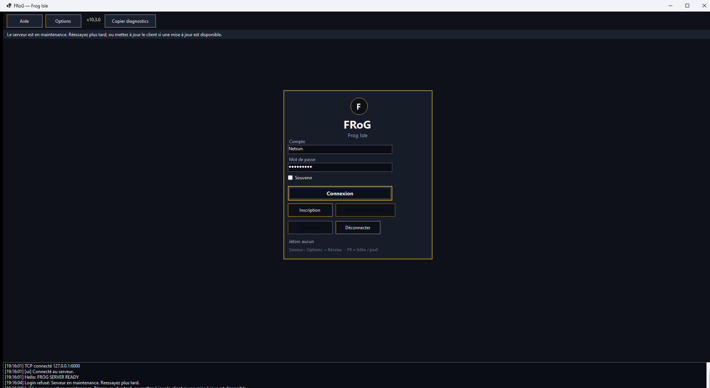

# Operations — stack bêta

Utilise ce guide quand tu **démarres, arrêtes, sauvegardes ou restaures** le serveur de bêta (pas pour jouer).

> Tip miroir docs : `d6e59759` · Maintenance flags **#31** livrés (refus login). Pas une diffusion joueur.

## Prérequis

- PostgreSQL 16
- Runtime / SDK .NET 8 selon le mode (from-source vs paquet)
- Overlay local **gitignoré** (jamais committer les secrets)

Référence détaillée Phase 9 :

- [OPERATIONS_RUNBOOK](../../phase-09-distribution-admin-hardening/OPERATIONS_RUNBOOK.md)
- [BACKUP_RESTORE_RUNBOOK](../../phase-09-distribution-admin-hardening/BACKUP_RESTORE_RUNBOOK.md)
- [PACKAGING_GUIDE](../../phase-09-distribution-admin-hardening/PACKAGING_GUIDE.md)

## 1. Démarrer (from-source, dev)

1. Démarrer PostgreSQL (ex. Compose du dépôt).
2. Copier l’exemple d’overlay local → fichier **gitignoré** à côté de l’hôte.
3. Renseigner la connexion via le fichier local **ou** la variable d’environnement documentée dans le runbook (valeurs = hors git / hors wiki).
4. Lancer le serveur : `dotnet run --project Frog.Server/Frog.Server.csproj`

**Résultat attendu :** processus qui écoute ; logs sans secret en clair dans les tickets.

**Rollback :** arrêter le processus ; ne pas publier l’overlay.

## 2. Mode maintenance (#31)

Refuse **nouveaux** login / inscription / reconnect. Les sessions **déjà** connectées ne sont **pas** coupées (pas de drain).

### Activer

| Levier | Comment |
| --- | --- |
| Config | `Maintenance:Enabled=true` dans `appsettings.json` ou overlay local |
| Env | `FROG_MAINTENANCE=1` (aussi `true` / `yes` / `on`) |
| Fichier | `FROG_MAINTENANCE_FILE=/chemin/flag` puis écrire `1` / `on` / `true` (ou fichier vide = on ; `0`/`off` = off) |
| Override process | `MaintenanceService.SetEnabledOverride(true)` (tests / ops in-process) |

Message wire par défaut : `Serveur en maintenance. Reessayez plus tard.` (`Maintenance:Message` surchargeable).

### Bypass opérateurs

- `Maintenance:AllowOperators=true` (défaut).
- Compte déjà dans `IOperatorDirectory` (grant hors TCP : `Frog.OpsCli operator grant`).
- Pas de nouvel opcode admin.

### Désactiver

- Remettre `Enabled=false`, unset `FROG_MAINTENANCE`, supprimer / écrire `0` dans le flag file, ou `SetEnabledOverride(null|false)`.

### Launcher stub (pas un installateur)

- Fichiers VERSION + `ClientVersionManifest.Compare` + `scripts/check-client-version.sh`.
- **Pas** d’HTTP, **pas** d’installateur, **pas** de CDN — compare locale / fichiers seulement.

STATUS : [maintenance-launcher/STATUS.md](../../maintenance-launcher/STATUS.md).

## 3. Sauvegarde / restauration

Suivre le runbook Phase 9 (étapes numérotées + preuves).

**Résultat attendu :** login possible après restore.

**Incomplet (honnête) :** restore avec lignes mute/ban (+ social/trade) pas encore couvert — voir [KNOWN_ISSUES](../KNOWN_ISSUES.md). **Drain** maintenance (kick sessions déjà en jeu) = **non livré** ; le *drapeau* de refus login ci-dessus **est** livré.

## 4. Ce qui est testable vs incomplet

| Sujet | Testable maintenant | Incomplet |
| --- | --- | --- |
| Serveur Linux publié | Oui (preuve Phase 9) | — |
| Maintenance refus login / register / reconnect | Oui (#31) | Drain / kick sessions déjà en jeu |
| Bypass opérateur sous maintenance | Oui (grant OpsCli) | — |
| Launcher stub compare VERSION | Oui (script local) | Installateur / HTTP / CDN |
| Client / éditeur paquet autonome | Selon build | packaging complet hors tip |
| TLS + certificat validé | Selon déploiement | — |
| Inscriptions fermées | ProvisionedOnly | — |

## Secrets

- Nommer les variables / fichiers (`appsettings.Local.json`, variable Postgres documentée).
- **Jamais** coller les valeurs dans ce guide, le wiki, ou un ticket public.

## Et après ?

- [KNOWN_ISSUES](../KNOWN_ISSUES.md)
- Wiki : [Ops](https://github.com/Netsuno/MMO_Maker/wiki/Ops)
