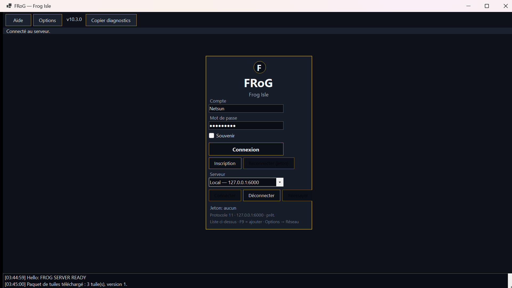
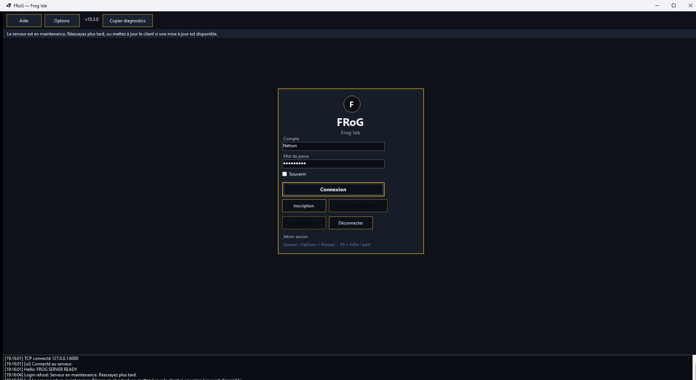
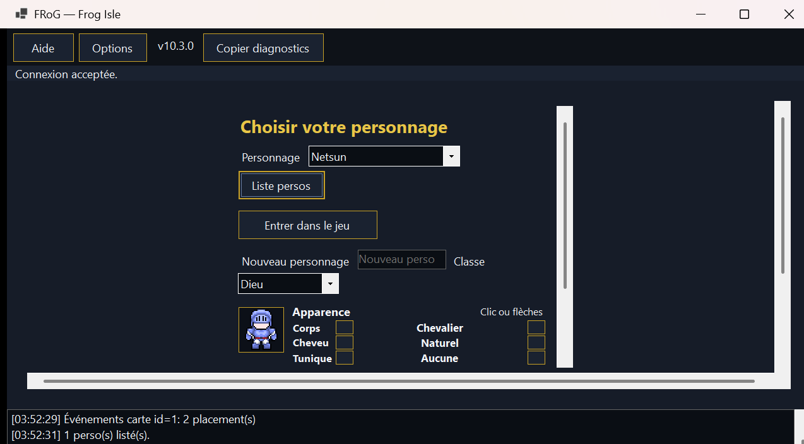
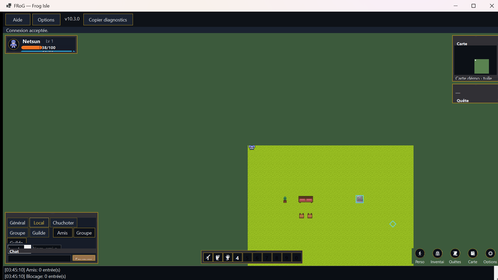
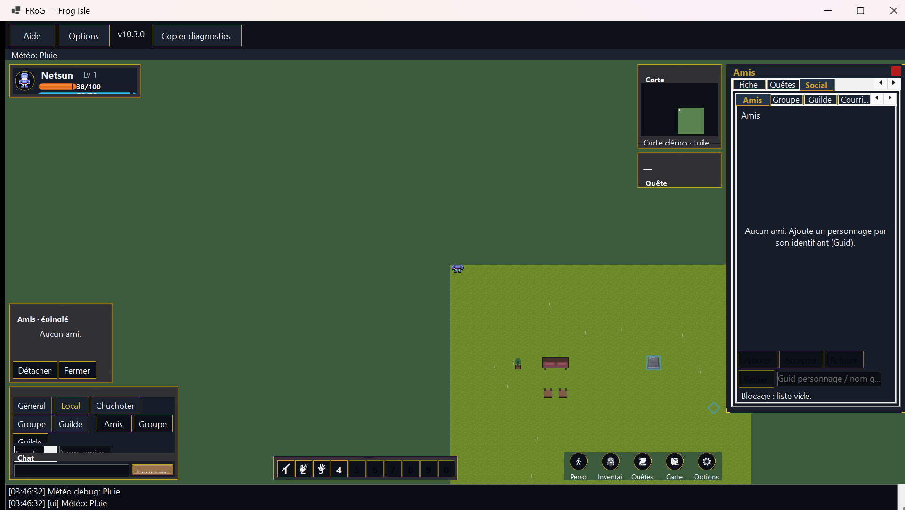
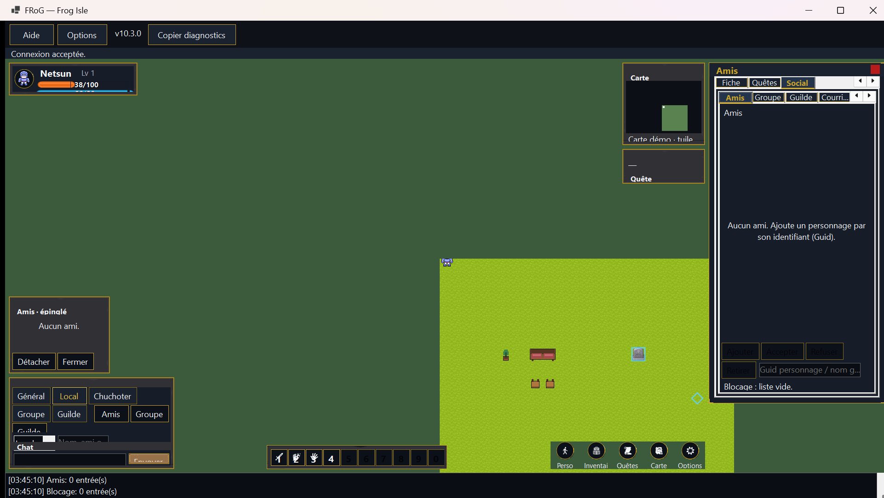

# Quickstart joueur

À la fin de ce guide, tu es connecté, tu as un personnage, et tu peux te déplacer, chatter, ouvrir Amis / Groupe / Guilde, régler le **Son**, et voir la **météo** (F8).

> **Bêta en cours** — certaines étapes (paquet autonome, connexion chiffrée, invitation fermée) ne sont pas encore dans tous les builds. Suis le message de l’opérateur pour *ton* build.

Tip miroir docs : `d6e59759` · #27 Social · #28 Audio · #30 Weather · #31 Maintenance (ops) · #32/#33 **échafaudage** économie/instance (pas gameplay).

## Prérequis

- Client MMO Maker fourni pour la bêta (Windows 11 x64, protocole **v11**)
- Identifiants de test envoyés par l’opérateur
- Connexion Internet stable

## 1. Lancer le client

Ouvre le client et attends l’écran de connexion.

<!-- CAPTURE: assets/joueur-01-connexion.png -->

*Écran de connexion : identifiant saisi, bouton Connexion.*

Si le serveur est en **maintenance**, le login affiche un message clair (« maintenance » / réessayer) — ce n’est pas un bug d’auth. Voir l’opérateur.

<!-- CAPTURE: assets/login-01-maintenance.png -->

*Écran login : barre de statut + log « Login refusé » quand le serveur est en maintenance (tip captures 2026-09-20).*

## 2. Choisir ou créer un personnage

Sur l’écran personnages, sélectionne une case libre ou un personnage existant, puis confirme.

<!-- CAPTURE: assets/joueur-02-perso.png -->

*Écran de choix du personnage.*

## 3. Premiers pas en jeu

Une fois en carte, déplace-toi avec les contrôles indiqués à l’écran (ou rappelés par l’opérateur). **F1** = Aide.

<!-- CAPTURE: assets/joueur-03-hud.png -->

*Vue en jeu : personnage sur la carte, chat en bas.*

## 4. Options — Son (volume / muet / musique)

1. Ouvre **Options** (bouton Options ou pill HUD) — un clic UI peut jouer `ui-click.wav` si le son n’est pas muet.
2. Va dans l’onglet **Son**.
3. Règle le **slider volume** (0–100).
4. Case **Muet (SFX + musique)** : silence total (SFX + boucle).
5. Case **Musique (boucle placeholder)** : opt-in ; défaut **off** (playtest silencieux). Enregistre pour persister dans `client-settings.json`.

Détail contrôles : [UI-CLIENT-Options.md](UI-CLIENT-Options.md).

<!-- CAPTURE: assets/options-01-son.png -->
*Capture à venir : Options → Son — slider volume, cases Muet et Musique.*

## 5. Météo — cycle F8

En jeu, **F8** fait cycler l’overlay debug : **Auto → Clair → Pluie → Brouillard** (teinte + traits de pluie). Auto suit le profil / kind publié par le serveur (opcode 74, protocole **11**). Aide **F1** le rappelle.

<!-- CAPTURE: assets/weather-01-f8-rain.png -->

*Carte en jeu sous pluie après un cycle F8.*

## 6. Social — Amis / Groupe / Guilde (HUD)

Le social ne passe **plus seulement** par les slash du chat.

1. Dans le **dock chat** (bas), clique **Amis**, **Groupe** ou **Guilde**.
2. L’overlay s’ouvre sur l’onglet **Social** avec le sous-onglet choisi.
3. Saisis un **Guid** personnage dans le champ bas pour inviter / ajouter.
4. Utilise les boutons de l’onglet (ex. **Ajouter**, **Inviter**, **Accepter**, **Quitter**, **MOTD**…).

Détail : [UI-CLIENT-SocialHub.md](UI-CLIENT-SocialHub.md).

<!-- CAPTURE: assets/joueur-04-social-hud.png -->

*HUD en jeu après Ouvrir Amis : dock chat et overlay Social.*

### Slash (secondaire)

Toujours possibles : `/friend`, `/party`, `/guild`, `/block`. `/trade` = échange P2P (hors focus de ce quickstart).

Un redémarrage serveur **dissout les groupes**. Guildes / amis / blocages survivent.

## 7. Échafaudage — Courrier / HdV / Coffre / Instance (pas du gameplay)

Dans le même overlay **Social**, des onglets supplémentaires existent sur tip `d6e59759` :

- **Courrier / HdV / Coffre** (#32) — Query-only, listes **vides** (coffre : slots vides si guilde). **Pas** d’achat, d’envoi, de dépôt.
- **Instance** (#33) — catalogue **Ruines du Marais** / **Crypte du Roi**, boutons Entrer / Quitter **in-memory**. **Pas** de donjon persisté / carte instance PG.

Ne coche pas ces onglets comme « features joueur livrées ». Détail : [UI-CLIENT-SocialHub.md](UI-CLIENT-SocialHub.md).

## Tu es prêt si…

- [ ] Tu vois ton personnage sur la carte
- [ ] Tu peux te déplacer
- [ ] Tu peux ouvrir le chat (même sans écrire)
- [ ] Tu ouvres **Options → Son** et tu règles volume / muet / musique
- [ ] Tu cycles la météo avec **F8** (teinte visible en pluie / brouillard)
- [ ] Tu ouvres **Amis** ou **Groupe** ou **Guilde** depuis le dock chat

## Et après ?

- [Problèmes connus Phase 10](../KNOWN_ISSUES.md)
- [Signaler un bug](BUG_REPORT_TEMPLATE.md)
- Wiki : [Joueur](https://github.com/Netsuno/MMO_Maker/wiki/Joueur)
